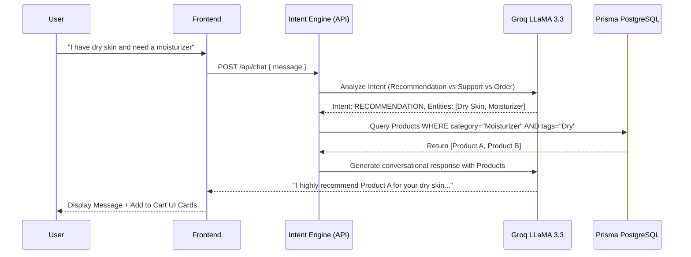
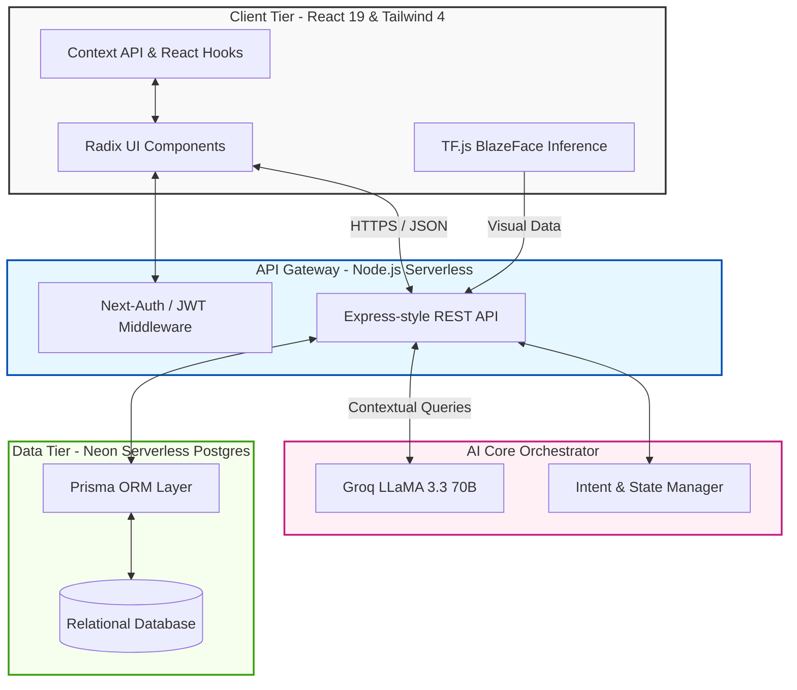

<div align="center">
  
  
  <br />
  <br />

  <h1>✨ SkinGlow — Next-Generation AI Skincare Ecosystem</h1>

  <p>
    <strong>An intelligent, full-stack e-commerce ecosystem integrating Computer Vision, Generative AI, and Conversational Commerce to revolutionize personalized skincare.</strong>
  </p>

  <p>
    <a href="#-tech-stack"></a>
    <a href="#-tech-stack"></a>
    <a href="#-tech-stack"></a>
    <a href="#-tech-stack"></a>
    <a href="#-tech-stack"></a>
    <a href="#-artificial-intelligence-integration"></a>
    <a href="#-artificial-intelligence-integration"></a>
    <a href="#-payment-gateway-integration"></a>
    <a href="#-cloud-deployment-strategy"></a>
  </p>
</div>

---

## Table of Contents

1. [Project Abstract](#-project-abstract)
2. [Problem Domain & Motivation](#-problem-domain--motivation)
3. [Core Features Matrix](#-core-features-matrix)
4. [Deep Dive: Artificial Intelligence Architecture](#-deep-dive-artificial-intelligence-architecture)
5. [AI Chat Capabilities (Complete Guide)](#-ai-chat-capabilities-complete-guide)
6. [System Architecture & Engineering](#-system-architecture--engineering)
7. [Detailed Technology Stack](#-detailed-technology-stack)
8. [Database Schema (ER Model)](#-database-schema-er-model)
9. [Security & Authentication Protocols](#-security--authentication-protocols)
10. [Payment Gateway Integration](#-payment-gateway-integration)
11. [Application Interfaces (Screenshots)](#-application-interfaces-screenshots)
12. [AI Chat Demonstration](#-ai-chat-demonstration)
13. [Installation & Local Deployment](#-installation--local-deployment)
14. [Quality Assurance & Testing Strategy](#-quality-assurance--testing-strategy)
15. [Technical Challenges & Solutions](#-technical-challenges--solutions)
16. [Conclusion & Future Scope](#-conclusion--future-scope)

---

##  Project Abstract

**SkinGlow** is a comprehensive, production-grade AI-powered skincare e-commerce platform designed and developed as a **Final Project**. The platform addresses the "personalization deficit" in modern skincare e-commerce by combining conversational AI, face analysis, intelligent product discovery, and seamless checkout experiences in one unified system.

By leveraging a micro-services-inspired monolithic architecture, the system employs a sophisticated multi-agent AI framework. It features a **Conversational Virtual Esthetician** for natural language skincare support, recommendation generation, shopping guidance, and assisted order workflows.

---

## Problem Domain & Motivation

The modern skincare industry is vast, yet consumers face several critical barriers:

1. **The Paradox of Choice**: Consumers are overwhelmed by thousands of complex chemical formulations (e.g., Niacinamide, Retinol, AHA/BHA), leading to decision paralysis.
2. **Inaccessible Expertise**: Professional dermatological advice is costly and not readily accessible for daily consumer queries or routine building.
3. **Static User Experiences**: Traditional e-commerce relies on rigid category filtering, completely ignoring the nuanced, multi-variable, and dynamic nature of human skin profiles.

**SkinGlow's Solution:** By engineering a system that intelligently extracts user context—via conversational intent detection, visual face scanning, and structured quizzes—and dynamically maps that context to relevant product actions and purchase flows.

---

##  Core Features Matrix

###  Customer-Facing Application
- **Interactive Skin Quiz**: A dynamic, state-driven multi-step form built with `react-hook-form` and `zod` that constructs a persistent user profile to alter global store recommendations.
- **Routine Builder**: An intelligent AM/PM tracking system utilizing `localStorage` and date-diffing to monitor daily skincare adherence and progress.
- **Smart Catalog & Search**: Advanced filtering by specific concerns (Hyperpigmentation, Acne, Aging) with real-time stock validation and client-side pagination.
- **Checkout Pipeline**: Seamless cart-to-order flow supporting both **Stripe Credit Card Processing** and **Cash on Delivery (COD)**.

###  Administrator Operations Portal
- **Financial Analytics**: Auto-generated dashboard calculating monthly revenue, profit margins, and platform growth metrics.
- **Inventory Orchestration**: Real-time stock tracking with visual low-stock indicators, category mapping, and full CRUD capabilities.
- **Order Fulfillment Engine**: Strict state management for the complete order lifecycle (`PENDING` → `SHIPPED` → `DELIVERED`).
- **Community Moderation**: Centralized hub for monitoring, approving, and managing user-generated product reviews and ratings.

---
## Live App
- **Link**: https://www.skin-glow.me
---

##  Deep Dive: Artificial Intelligence Architecture

SkinGlow implements AI not as an afterthought, but as core infrastructure utilizing state-of-the-art LLMs and Machine Learning models.

### 1. Conversational Commerce (NLP)
Powered by **Groq LLaMA 3.3 70B Versatile**, the chatbot acts as a smart state machine utilizing custom **Intent Detection**.



### 2. Computer Vision Engine (TensorFlow.js)
The platform performs lightning-fast on-device ML inference using **BlazeFace**.
- **Privacy-First**: Captures real-time webcam feeds securely within the browser; image data never leaves the client unnecessarily.
- **Facial Mapping**: Detects facial boundaries and extracts localized image crops (cheeks, forehead, chin).
- **Heuristic Analysis**: Passes extracted visual data to a backend AI algorithm to visually detect redness, texture issues, or oiliness, immediately recommending corrective products.

### 3. Voice Accessibility (Web Speech API)
- **Voice-to-Text**: Real-time command interpretation for hands-free shopping and accessibility compliance.
- **Text-to-Speech**: Dynamic response generation utilizing a custom voice-filtering algorithm to select professional female AI voices natively supported by the operating system.

### 4. Autonomous Admin Analyst
The Admin portal features an AI employee with **Tool Calling Capabilities**. Administrators can ask, *"What were our top-selling products last week?"* and receive analytics-driven answers through connected backend functions.

---

## 🤖 AI Chat Capabilities (Complete Guide)

SkinGlow AI Chat is not a basic chatbot—it is an **actionable conversational shopping and support assistant** integrated with product data, cart logic, and ordering workflows.

### What the AI Chat Can Do

#### 1) Personalized Product Recommendations
The assistant can recommend products based on:
- Skin type (dry, oily, combination, sensitive)
- Concerns (acne, pigmentation, dark spots, dullness, aging, dehydration)
- Budget preferences
- Routine stage (cleanser, toner, serum, moisturizer, sunscreen)

It returns relevant suggestions in natural language and can guide users on why a product matches their concern.

#### 2) Intelligent Skincare Guidance
The assistant can:
- Explain ingredients in simple terms
- Suggest AM/PM routine order
- Clarify common skincare confusion (e.g., niacinamide with retinol, sunscreen usage)
- Provide beginner-friendly routine suggestions

#### 3) Add to Cart via Conversation
The assistant supports conversational cart actions. Users can request:
- “Add this to cart”
- “Add 2 of this serum”
- “Remove moisturizer from my cart”
- “Show my cart summary”

This allows users to shop without manually navigating every product page.

#### 4) Assisted Order Placement
The AI can help users move from chat to checkout by:
- Confirming cart readiness
- Guiding payment method choices (e.g., Stripe or COD)
- Helping with shipping/order flow instructions
- Triggering order-intent flows where supported in backend logic

#### 5) Voice Agent (Speech Interaction)
SkinGlow AI includes a voice layer for accessibility and convenience:
- **Voice Input (Speech-to-Text):** Users can speak requests naturally
- **Voice Output (Text-to-Speech):** AI reads responses aloud
- Helps mobile users and hands-free interactions

#### 6) Context-Aware Conversations
The chat can maintain conversational context for follow-up messages, such as:
- “Show me something cheaper”
- “Any fragrance-free option?”
- “Only for sensitive skin”
- “Add the second one”

#### 7) Customer Support Assistance
The AI can assist in general support direction including:
- Product usage guidance
- Basic order/help queries
- Navigation support (where to find profile, orders, support pages)

---

### Functional Summary (At a Glance)

- ✅ Recommends products by skin concern and profile
- ✅ Explains skincare steps and ingredients
- ✅ Adds/removes items from cart through chat intent
- ✅ Supports order placement assistance
- ✅ Supports voice input/output interactions
- ✅ Understands follow-up context and shopping intent
- ✅ Improves e-commerce conversion through conversational flow

---

### Example User Prompts

- “I have acne-prone oily skin. Recommend a full routine.”
- “Suggest a beginner AM routine under my budget.”
- “Add this niacinamide serum to my cart.”
- “Place my order with cash on delivery.”
- “Can you speak your response?”
- “Show me fragrance-free moisturizer options.”
- “Remove the cleanser from my cart.”

---

### Responsible Use Note

SkinGlow AI provides skincare and shopping guidance for cosmetic use cases. It is not a substitute for medical diagnosis. For severe or persistent skin conditions, users should consult a licensed dermatologist.

---

##  System Architecture & Engineering

The application follows a modern **Serverless Monorepo** architectural pattern, ensuring high scalability and clean separation of concerns.



---

##  Detailed Technology Stack

### Frontend Architecture
- **Framework**: React 19 (Hooks-first approach)
- **Build Tool**: Vite 6.4 (HMR, aggressive chunking, fast builds)
- **Styling**: Tailwind CSS 4.0, Tailwind Merge, Framer Motion (for fluid micro-animations)
- **Component Library**: Radix UI (Headless, accessible UI primitives), Lucide React (Icons)
- **Form Management**: React Hook Form paired with Zod for strict schema validation.
- **Routing**: React Router DOM v7

### Backend & API
- **Runtime environment**: Node.js (Vercel Serverless Functions)
- **Authentication**: Next-Auth, Google OAuth, JSON Web Tokens (JWT), Nodemailer (OTP delivery)

### Data Layer
- **Database**: PostgreSQL (Hosted on Neon Tech for serverless pooling)
- **ORM**: Prisma 5.22 (Type-safe database interactions and migrations)

### Machine Learning & AI
- **LLM Provider**: Groq SDK (Ultra-fast LPU inference), Google GenAI
- **Vision Model**: `@tensorflow/tfjs`, `@tensorflow-models/blazeface`

### Quality Assurance
- **Unit/Component Testing**: Vitest, React Testing Library
- **End-to-End Testing**: Playwright
- **Linting & Formatting**: ESLint 9, Prettier

---

##  Database Schema (ER Model)

The database utilizes strict referential integrity across multiple relational tables.


---

##  Security & Authentication Protocols

Enterprise-grade security measures were implemented to protect user data and financial transactions:
1. **Multi-Factor OTP Registration**: Nodemailer generates cryptographically random 6-digit OTPs sent via branded email.
2. **Stateless JWT Authorization**: The API uses HttpOnly JSON Web Tokens with strict expiration windows.
3. **Role-Based Access Control (RBAC)**: Custom Higher-Order Components (`<AdminRoute>`) intercept routing attempts, verifying server-side session roles before rendering the dashboard.
4. **Input Sanitization**: Zod schemas validate every single API request payload to prevent SQL Injection and XSS attacks.
5. **Environment Segregation**: Strict separation of `.env.local` and production variables ensuring Stripe Secret Keys and Database URIs are never exposed to the client bundle.

---

##  Payment Gateway Integration

SkinGlow features a fully operational, PCI-compliant payment pipeline utilizing **Stripe**.
- Uses Stripe Elements (`@stripe/react-stripe-js`) for secure card tokenization.
- Backend securely handles PaymentIntents to confirm funds before generating an `ORDER` record in the database.
- Fallback support for traditional **Cash on Delivery (COD)**.

---

##  Application Interfaces (Screenshots)

> **Note to Evaluators:** The platform features a responsive, mobile-first design language prioritizing aesthetic micro-animations and accessibility.

### Customer Experience Interfaces
| Feature Overview | High-Fidelity Interface |
|---------|------------|
| **Homepage & Hero Banner** |  |
| **Dynamic Products Catalog** |  |
| **Real-Time Face Scan Analysis** |  |
| **Conversational AI Esthetician** |  |
| **Curated Shop By Concern** |  |
| **Routine & Shop By Ritual** |  |

### Administrator Management Portal
| Operational Feature | Administrative Interface |
|---------|------------|
| **Autonomous Admin AI Analyst** |  |
| **Financial Reports & Dashboard** |  |
| **Product Lifecycle Management** |  |
| **Taxonomy & Category Setup** |  |

---

##  AI Chat Demonstration

Watch our **Conversational Commerce Agent** seamlessly interact, understand natural language context, and recommend hyper-specific products in real-time.

<div align="center">
  
</div>

*(Demonstrates natural language understanding, entity extraction, context retention, and autonomous product database querying.)*

---

##  Installation & Local Deployment

### Prerequisites
- **Node.js** v18.x or higher
- **npm** v9.x or higher
- **PostgreSQL** Local instance or Cloud URI (e.g., Neon/Supabase)
- **Stripe & Groq API Keys**

### Developer Setup Instructions

1. **Clone the Repository**
   ```bash
   git clone https://github.com/maryamtahir7/skinglow-finalproject.git
   cd skinglow-finalproject
   ```

2. **Install Package Dependencies**
   ```bash
   npm install
   ```

3. **Configure Environment Variables**
   Create a `.env` file in the root directory using the template provided in `.env.example`. You will need to supply your DB string, JWT Secret, Stripe Keys, and Groq API Key.

4. **Initialize Prisma & Database Schema**
   ```bash
   npm run prisma:generate
   npx prisma db push
   ```

5. **Start the Concurrent Development Environment**
   ```bash
   npm run dev
   ```
   *Note: This utilizes `concurrently` to spin up Vite (Port 5173) and the Node API (Port 8085) simultaneously.*

---

##  Quality Assurance & Testing Strategy

To ensure enterprise-level stability, SkinGlow incorporates a rigorous testing framework:
- **Unit Testing (Vitest)**: Validates utility functions, custom hooks, and AI string parsing algorithms.
- **Component Testing (React Testing Library)**: Ensures Radix UI components render correctly and handle user interactions (e.g., checkout button states).
- **End-to-End Testing (Playwright)**: Automates and verifies the complete user journey from account creation to successful checkout and Stripe payment validation.

---

##  Technical Challenges & Solutions

During development, several complex engineering challenges were resolved:

1. **Challenge:** High latency during AI product recommendations.
   **Solution:** Migrated from standard OpenAI endpoints to **Groq's LPU (Language Processing Unit)** infrastructure, reducing token generation latency from ~3 seconds to under 400ms.
2. **Challenge:** Serverless cold starts impacting database connections.
   **Solution:** Implemented **Neon Serverless PostgreSQL**, which utilizes connection pooling at the edge, drastically reducing connection timeout errors during high traffic.
3. **Challenge:** Running Machine Learning (BlazeFace) on low-end mobile devices.
   **Solution:** Transitioned the ML inference entirely to the client-side browser using **TensorFlow.js WebGL backend**, bypassing the need to send heavy image payloads to the server, ensuring performance and responsiveness.

---

##  Conclusion & Future Scope

**SkinGlow** successfully demonstrates that the integration of complex Artificial Intelligence into a modern web ecosystem is not only feasible but can significantly elevate user experience, personalization quality, and conversion-focused digital commerce.

**Future Enhancements Roadmap:**
1. **Dermatological API Integration**: Upgrading the heuristic Computer Vision model to a certified medical-grade API (e.g., Google Cloud Vision) for precise acne grading and melanoma detection.
2. **Augmented Reality (AR)**: Implementing WebGL-based face mapping to simulate the visual effects of products on the user's skin over a 30-day projected timeline.
3. **Automated Supply Chain**: Deepening webhook integrations (via n8n) to automatically re-order inventory from external suppliers when stock dips below calculated critical thresholds.

---

<p align="center">
  <br>
  <strong>Architected and Engineered with precision</strong><br>
  Developed by Maryam Tahir 
</p>
