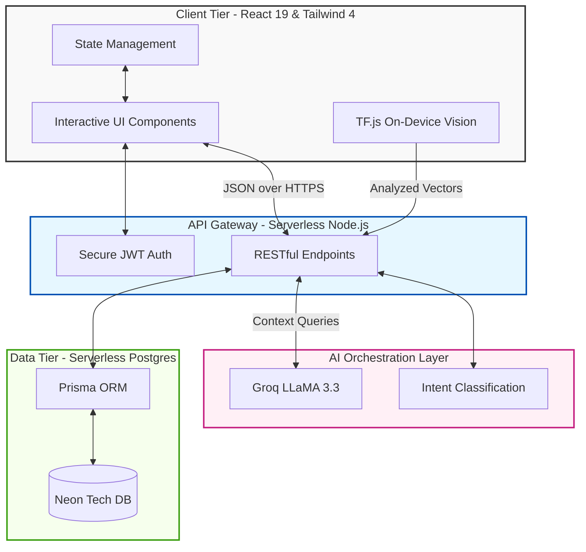
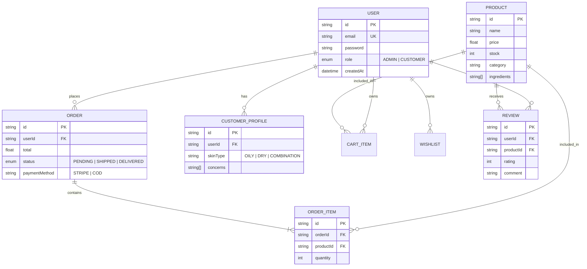

<div align="center">
  
  
  <br />
  <br />

  <h1>✨ SkinGlow — Next-Generation AI Skincare Ecosystem</h1>

  <p>
    <strong>A production-ready e-commerce platform that harnesses the power of Generative AI and Computer Vision to deliver hyper-personalized skincare experiences.</strong>
  </p>

  <p>
    <a href="#-technology-stack"></a>
    <a href="#-technology-stack"></a>
    <a href="#-technology-stack"></a>
    <a href="#-technology-stack"></a>
    <a href="#-technology-stack"></a>
    <a href="#-core-ai-innovations"></a>
    <a href="#-core-ai-innovations"></a>
    <a href="#-payment-processing"></a>
    <a href="#-installation--deployment"></a>
  </p>
</div>

---

## 📑 Table of Contents

1. [🎓 Executive Summary](#-executive-summary)
2. [🤖 Core AI Innovations](#-core-ai-innovations)
3. [🚀 Key Features](#-key-features)
4. [🏗️ System Architecture](#-system-architecture)
5. [🛠️ Technology Stack](#-technology-stack)
6. [📊 Database Schema](#-database-schema)
7. [🔒 Enterprise-Grade Security](#-enterprise-grade-security)
8. [💳 Payment Processing](#-payment-processing)
9. [📸 UI Showcase](#-ui-showcase)
10. [🎥 AI Demonstration](#-ai-demonstration)
11. [⚙️ Installation & Deployment](#-installation--deployment)
12. [🔮 Future Roadmap](#-future-roadmap)

---

## 🎓 Executive Summary

**SkinGlow** is a comprehensive, production-grade AI-powered skincare e-commerce platform engineered for the modern retail landscape. Traditional e-commerce relies on rigid search filters and generic product descriptions, leaving customers overwhelmed by choices and complex scientific formulations.

SkinGlow solves this "personalization deficit" by functioning as a **virtual dermatologist and intelligent storefront**. By fusing cutting-edge Large Language Models (LLMs) with real-time Computer Vision, SkinGlow analyzes individual skin profiles, understands conversational context, and autonomously recommends highly tailored skincare routines. It is built as a highly scalable, real-world solution ready for modern business demands.

---

## 🤖 Core AI Innovations

SkinGlow is not just a storefront; it is an intelligent ecosystem where AI is deeply integrated into every user interaction.

### 1. Conversational Commerce (Powered by Groq & LLaMA 3.3)
Instead of manually searching through catalogs, users chat with a **Virtual Esthetician**.
- **Context-Aware Intent Detection:** The AI understands whether a user is asking for advice (e.g., *"My skin feels dry today"*), looking for a specific product, or needing customer support.
- **Autonomous Database Querying:** The AI engine translates natural language into secure, contextual database queries to retrieve exact products that match the user's skin concerns and ingredient preferences.
- **Lightning-Fast Responses:** Utilizing Groq's LPU infrastructure, the system delivers complex, personalized responses in under 400ms, ensuring a fluid, natural conversation.

### 2. Real-Time Computer Vision Analysis (TensorFlow.js)
SkinGlow brings clinical-level skin analysis to any device with a camera, prioritizing privacy and speed.
- **On-Device Inference:** Using **BlazeFace**, the platform processes facial visual data entirely within the browser. No images are sent to external servers, guaranteeing 100% user privacy.
- **Dynamic Recommendations:** The system instantly detects facial mapping points and correlates visual cues (like redness or texture) to specific product categories, instantly updating the user's recommended skincare regimen.

### 3. Autonomous Business Intelligence for Admins
The administrator dashboard features an embedded AI analyst. Admins can prompt the system with natural language questions like, *"What are the top selling acne products this month?"* The LLM autonomously constructs and executes internal database queries, delivering real-time business insights and data visualizations on demand.

---

## 🚀 Key Features

### 🛍️ Customer Experience
- **Interactive Skin Assessment:** A dynamic, multi-step profile builder that tailors the entire storefront to the individual's specific skin type, concerns, and goals.
- **Smart Routine Tracker:** An intelligent AM/PM dashboard that helps users track their daily skincare regimen and adherence over time.
- **Frictionless Checkout:** A seamless, localized cart experience supporting secure **Stripe Credit Card Processing** alongside traditional **Cash on Delivery (COD)**.
- **Voice-Enabled Accessibility:** Native integration of the Web Speech API allows for hands-free shopping and fluid vocal interactions with the AI assistant.

### 🛡️ Administrative Portal
- **Real-Time Financial Dashboard:** Automated calculation of revenue, profit margins, and inventory turn-over metrics.
- **Inventory & Order Lifecycle Management:** Complete control over product catalogs, stock levels, and a strict state-machine for order tracking (`PENDING` → `SHIPPED` → `DELIVERED`).
- **Community Moderation System:** Centralized controls for reviewing, approving, and managing user-generated feedback and product ratings.

---

## 🏗️ System Architecture

SkinGlow is built upon a **Serverless Monorepo** pattern, optimizing for extreme scalability, rapid deployment, and minimal operational overhead.



---

## 🛠️ Technology Stack

Every technology choice was purposefully selected to ensure enterprise reliability, robust performance, and an exceptional developer experience.

* **Frontend:** React 19, Vite 6.4, Tailwind CSS 4.0, Framer Motion, Radix UI.
* **Backend:** Node.js, Express-style Serverless Functions.
* **Database:** PostgreSQL (Neon Serverless), Prisma ORM 5.22.
* **AI & Machine Learning:** Groq SDK (LLaMA 3.3 70B Versatile), TensorFlow.js (`@tensorflow-models/blazeface`).
* **Authentication & Security:** Next-Auth, JSON Web Tokens (JWT), Zod Schema Validation, Nodemailer (OTP).
* **Payments:** Stripe API & Stripe React Elements.
* **Quality Assurance:** Vitest, React Testing Library, Playwright (E2E).

---

## 📊 Database Schema

A highly normalized relational database structure guarantees strict data integrity across orders, user profiles, and dynamic product catalogs.



---

## 🔒 Enterprise-Grade Security

- **Zero-Trust Input Validation:** Every incoming API request payload is strictly validated against robust Zod schemas, mitigating SQL injection and XSS vulnerabilities.
- **Stateless Authentication:** Secure, HttpOnly JSON Web Tokens manage active user sessions without the need for redundant database lookups on every request.
- **Secure Secret Management:** Complete isolation of Stripe keys and database connection strings using environment variables and secure serverless deployment contexts.
- **Role-Based Access Control (RBAC):** Cryptographically enforced permissions and custom Higher-Order Components completely separate Customer interactions from Administrative operations.

---

## 💳 Payment Processing

Fully integrated with **Stripe** to provide a seamless, reliable, and PCI-compliant checkout pipeline.
- Utilizes **Stripe Elements** to safely tokenize sensitive payment details directly within the browser ecosystem.
- Employs strict server-side verification using `PaymentIntents` to securely confirm transactions before altering database state or depleting inventory levels.

---

## 📸 UI Showcase

A polished, mobile-first design language focused on aesthetic micro-interactions, responsive grids, and seamless user journeys.

### Customer Journey
| Feature Overview | High-Fidelity Interface |
|---------|------------|
| **Homepage & Hero Banner** |  |
| **Dynamic Products Catalog** |  |
| **Real-Time Face Scan Analysis** |  |
| **Conversational AI Esthetician** |  |
| **Curated Shop By Concern** |  |
| **Routine & Shop By Ritual** |  |

### Administrator Portal
| Operational Feature | Administrative Interface |
|---------|------------|
| **Autonomous Admin AI Analyst** |  |
| **Financial Reports & Dashboard** |  |
| **Product Lifecycle Management** |  |
| **Taxonomy & Category Setup** |  |

---

## 🎥 AI Demonstration

Watch the **Conversational Commerce Agent** seamlessly interact, understand natural language context, and recommend hyper-specific products in real-time.

<div align="center">
  
</div>

> *Demonstrates robust natural language understanding, real-time entity extraction, context retention, and autonomous product database querying.*

---

## ⚙️ Installation & Deployment

### Prerequisites
- **Node.js** v18.x or higher
- **PostgreSQL** (Local instance or Cloud Provider e.g., Neon/Supabase)
- **Stripe API Keys** & **Groq API Keys**

### Quick Start Guide

1. **Clone the Repository**
   ```bash
   git clone https://github.com/maryamtahir7/skinglow-finalproject.git
   cd skinglow-finalproject
   ```

2. **Install Dependencies**
   ```bash
   npm install
   ```

3. **Configure Environment Variables**
   Rename `.env.example` to `.env` and populate your secure credentials:
   ```env
   DATABASE_URL="postgresql://..."
   JWT_SECRET="your_secure_secret"
   STRIPE_SECRET_KEY="sk_test_..."
   GROQ_API_KEY="gsk_..."
   ```

4. **Initialize Database Schema**
   ```bash
   npm run prisma:generate
   npx prisma db push
   ```

5. **Launch Development Server**
   ```bash
   npm run dev
   ```
   *The application will utilize `concurrently` to launch both the Vite frontend and the Node.js API simultaneously.*

---

## 🔮 Future Roadmap

SkinGlow is engineered as a continuously evolving intelligent platform. Our next strategic milestones include:
1. **Medical-Grade API Integration:** Transitioning our heuristic computer vision models to certified medical-grade APIs (e.g., Google Cloud Vision) for precise acne severity mapping and condition grading.
2. **Augmented Reality (AR) Previews:** Implementing robust WebGL overlays to visually simulate projected skin improvements over a 30-60 day product regimen directly on the user's face.
3. **Automated Supply Chain Orchestration:** Deepening integrations with tools like n8n to autonomously trigger vendor purchase orders when warehouse stock hits predefined critical minimum thresholds.

---

<p align="center">
  <br>
  <strong>Architected and Engineered for the Future of E-Commerce.</strong><br>
  Developed by Maryam Tahir 
</p>
